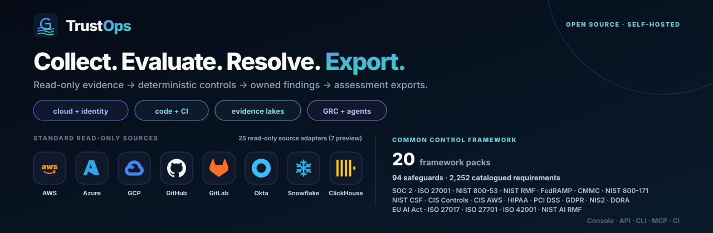
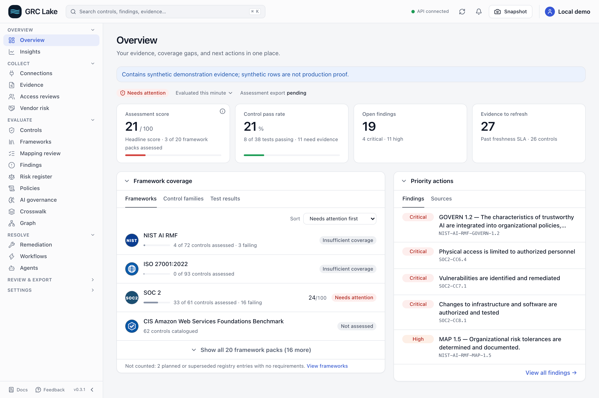
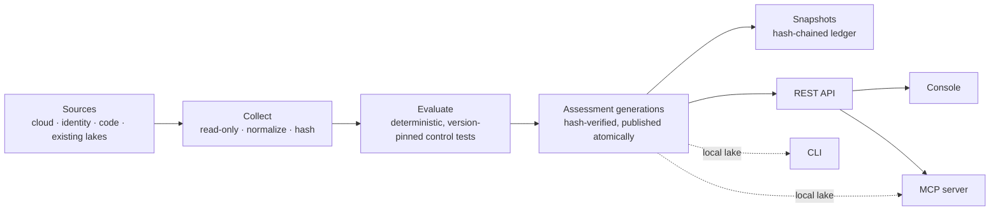
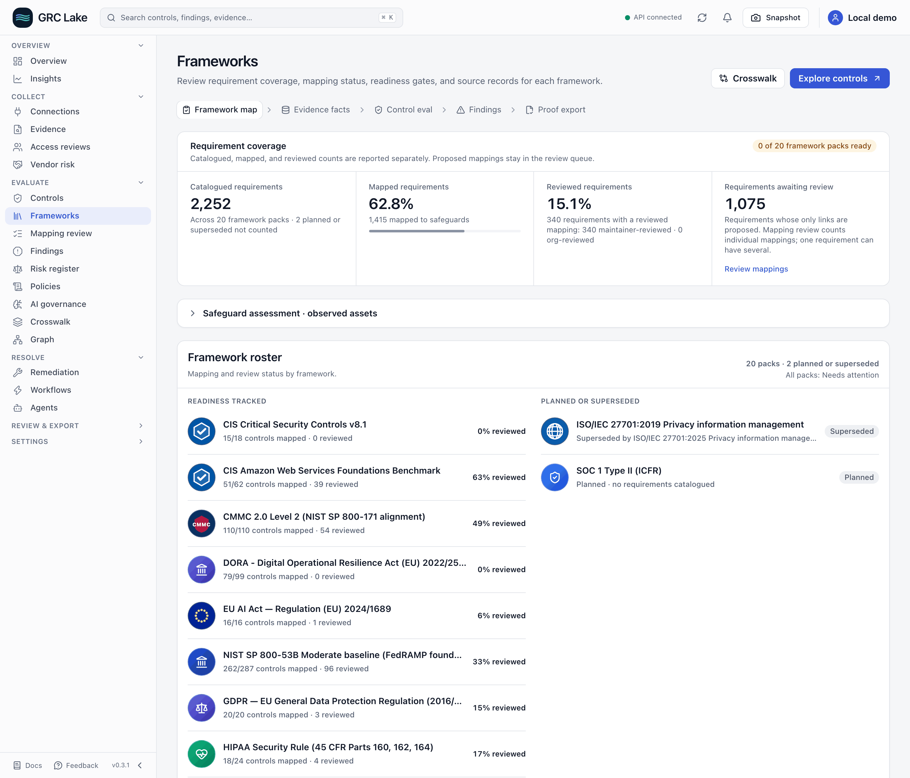
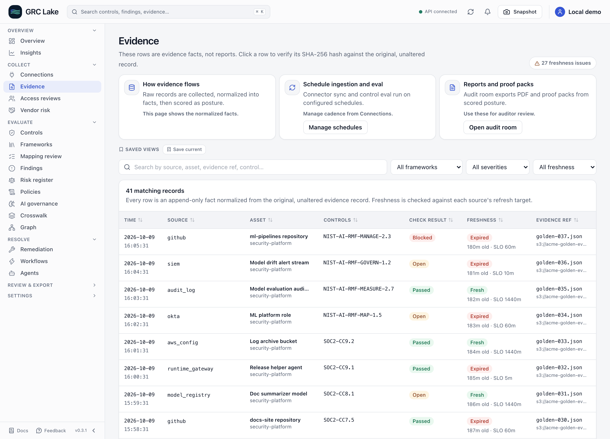
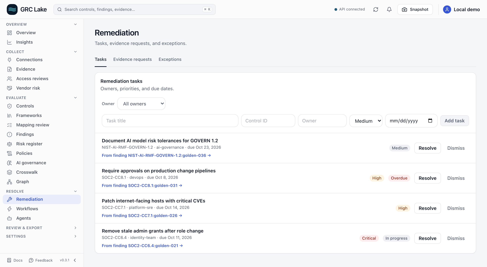
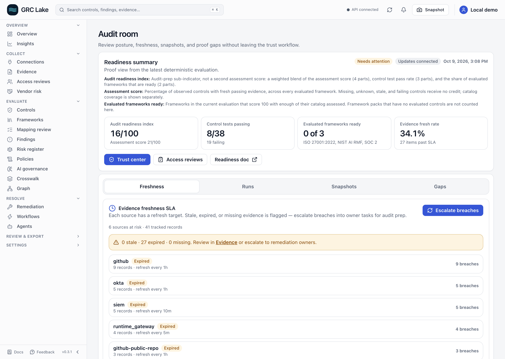
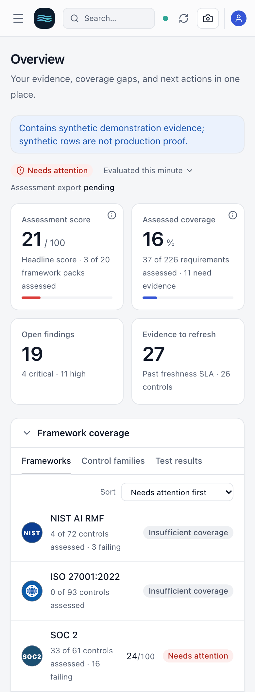

> Renamed from TrustOps. See the [upgrade guide](docs/REBRANDING.md) for command aliases, existing volumes and release availability.

<p align="center">
  

</p>

<p align="center">
  <a href="https://pypi.org/project/grc-lake/"></a>
  <a href="https://pypi.org/project/grc-lake/"></a>
  <a href="https://github.com/msaad00/grc-lake/actions/workflows/ci.yml"></a>
  <a href="LICENSE"></a>
  <a href="https://scorecard.dev/viewer/?uri=github.com/msaad00/grc-lake"></a>
</p>

**Open-source trust operations, on your evidence lake.** Self-hosted GRC
engineering: collect read-only evidence from cloud, identity, code, and existing
security lakes; evaluate it with deterministic, version-pinned control tests;
export snapshots, workpapers, and OSCAL.

<!-- BEGIN README AT A GLANCE -->

- **20 framework packs, 2,252 catalogued requirements,** linked through 94 common safeguards. 1,415 requirements have safeguard mappings; 340 have reviewed mappings and the other 1,075 are proposed.
- **25 read-only source adapters (7 in preview)**, plus OCSF presets for existing security lakes.
- **Fails closed:** missing, stale, or partial evidence never produces a pass, and proposed mappings are not attestable.
- **One engine, four surfaces:** console, REST API, CLI, and MCP server. Agents propose; humans approve.

<!-- END README AT A GLANCE -->

[Quick start](#quick-start) · [Architecture](#architecture) · [Evidence modes](#evidence-modes) ·
[Product tour](#product-tour) · [Self-host](#self-host) · [Frameworks](#frameworks) · [Documentation](#documentation)

## Quick start

With Docker Compose v2:

```bash
git clone https://github.com/msaad00/grc-lake.git
cd grc-lake
docker compose up
```

Open [localhost:8787/console/dashboard/](http://127.0.0.1:8787/console/dashboard/).
The demo binds to loopback and has authentication disabled. Follow the
[5-minute tutorial](docs/TUTORIAL_5_MIN.md) to connect a source and export results.

<details>
<summary>Install with pip, run from source, or connect an agent</summary>

Python 3.11+:

```bash
pip install "grc-lake[server]"
grc-lake fixtures load --company golden --out ./lake --rebase-times
grc-lake assessment status --lake ./lake
grc-lake serve --server --allow-insecure-no-auth --lake ./lake --port 8787
```

From source, with [uv](https://docs.astral.sh/uv/) and Node 22+:

```bash
uv sync --frozen --extra dev --extra server
make demo-local
```

For MCP over stdio:

```bash
pip install 'grc-lake[mcp]'
GRC_LAKE_LAKE=./lake grc-lake-mcp
```

Read [headless GRC](docs/HEADLESS_GRC.md) for agent credentials and authority.

</details>

The PyPI package is `grc-lake`, the CLI is
`grc-lake`, and the MCP server is `grc-lake-mcp`.

<picture>
  <source media="(prefers-color-scheme: dark)" srcset="docs/images/grc-lake-demo-dashboard-dark.png">
  
</picture>

_Screens show the bundled synthetic company. They demonstrate workflows, not a
customer deployment or an audit opinion._

## Architecture



Connectors only read from source systems. Deterministic rules own every result;
agents can propose changes but do not decide them. Each run publishes a new
generation whose artifact hashes are verified before it becomes current, and
each snapshot records its predecessor's hash. The CLI works on a local lake; the
MCP server reads a local lake or calls the authenticated API. See
[architecture](docs/ARCHITECTURE.md).

## Evidence modes

Both modes feed the same evaluation engine, assessments, and review workflows.

| Mode              | Start with                                                                        | How it works                                                                                                                                                                                                                                                                                                 |
| ----------------- | --------------------------------------------------------------------------------- | ------------------------------------------------------------------------------------------------------------------------------------------------------------------------------------------------------------------------------------------------------------------------------------------------------------ |
| **Existing lake** | Logs, security events, and evidence already ingested into your lake or warehouse. | Read-only readers query existing tables; [lake mappings](docs/BRING_YOUR_OWN_LAKE.md) translate their fields into evidence. Snowflake, ClickHouse, Databricks, BigQuery, and Iceberg/Parquet readers include OCSF presets for Amazon Security Lake. S3 evidence and SIEM exports are also supported sources. |
| **Ingest**        | Cloud, identity, code, endpoint, and SaaS systems; no existing lake required.     | Read-only connectors collect evidence into storage you own. Sources include AWS, Azure, GCP, GitHub, GitLab, Okta, Google Workspace, Jira, Intune, and HR systems.                                                                                                                                           |

**Already have a lake?** Start with [bring your own lake](docs/BRING_YOUR_OWN_LAKE.md).
**Collecting new evidence?** Start with [connector setup](docs/CONNECTOR_CREDENTIALS.md).
Lake mappings are experimental; preview and live-provider qualification vary by
reader. See the [connector catalog](docs/CONNECTORS.md) for status. Existing-lake
readers preserve the source system and materialize assessment evidence into the
GRC Lake lake; they do not move the GRC Lake application into your warehouse.

## Product tour

| Workflow     | What you get                                                                     |
| ------------ | -------------------------------------------------------------------------------- |
| **Collect**  | Source evidence with identity, timestamps, hashes, and collection status.        |
| **Evaluate** | Deterministic results pinned to a catalog and evidence generation.               |
| **Resolve**  | Assigned findings, follow-up verification, and independently reviewed decisions. |
| **Export**   | Snapshots, workpapers, OSCAL, and scoped, revocable auditor shares.              |

### Know what is covered

Framework coverage separates assessed controls, missing evidence, and unreviewed
mappings. A passing sample does not establish full framework compliance.

<picture>
  <source media="(prefers-color-scheme: dark)" srcset="docs/images/grc-lake-demo-frameworks-dark.png">
  
</picture>

### Follow evidence to a decision

Inspect the source, freshness, and affected controls before assigning a finding.
Closing a task requires fresh verification; approval actions require an eligible
human session. Agents can collect, explain, and propose work.

<picture>
  <source media="(prefers-color-scheme: dark)" srcset="docs/images/grc-lake-demo-evidence-dark.png">
  
</picture>

<details>
<summary>More screens: remediation, audit room, and mobile</summary>





</details>

## Self-host

Use [Docker or Helm](deploy/README.md), configure [SSO and scoped credentials](docs/SERVER_AUTH.md),
and choose the [storage and writer topology](docs/runbooks/HA_READ_REPLICAS.md).
Evidence stays in storage you operate; data leaves through the connectors, sinks,
and model integrations you configure.

- **Local mode:** one writable replica with a local JSONL lake and SQLite or PostgreSQL.
- **Distributed mode:** multiple API replicas and tenant workers share PostgreSQL
  and S3-compatible object storage, with private scratch space and fenced publication.
  Enable it explicitly using the [distributed deployment guide](docs/DISTRIBUTED.md).
  A single tenant evaluation still runs on one worker; production capacity and
  provider failover require deployment-specific qualification.
- **Warehouse exports** have separate setup and qualification requirements.
  See [data flow](docs/DATA_FLOW.md).
- **Authentication is required for production.** The loopback demo is a separate
  setup. Human approval, tenant isolation, and read-only auditor access are
  enforced at the API boundary.
- **Retain evidence deliberately.** Use the [operations guide](docs/OPERATIONS_CONTRACTS.md)
  for generation archival, history costs, and external integrity checkpoints.

See the [connector catalog](connectors/catalog.json) for implementation and preview
status, and [credential setup](docs/CONNECTOR_CREDENTIALS.md) for each source.

### Verify a release

Wheels and sdists carry SLSA build provenance, and each GitHub release attaches
a CycloneDX SBOM of the locked runtime dependencies:

```bash
gh release download v0.3.1 -R msaad00/grc-lake -p '*.whl'
gh attestation verify grc_lake-0.3.1-py3-none-any.whl -R msaad00/grc-lake
```

## Frameworks

Common safeguards connect source evidence to framework requirements. Proposed
crosswalks remain review work; reviewed mappings are version-pinned and still
need applicable evidence. The legacy `fedramp-moderate` pack represents the
NIST 800-53B Moderate foundation, not a complete FedRAMP authorization package.

<details>
<summary>Generated catalog coverage and control families</summary>

<!-- BEGIN README CCF SUMMARY -->

**20 framework packs · 94 reusable safeguards · 21 control families in 10 categories · 2,252 catalogued requirements.** 2 more registry entries are planned or superseded and hold no requirements.

1,415 requirements have safeguard mappings; **340 have reviewed mappings**. Catalog coverage and evaluated customer posture are separate measures.

Control families by category:

- **Governance and risk:** Risk management · Governance
- **Identity and access:** Identity and access
- **Data protection and privacy:** Data protection · Privacy
- **Secure engineering:** Change management · Secure development · Secure architecture
- **Infrastructure security:** Configuration management · Vulnerability management · Network security
- **Detection and response:** Detection · Audit logging · Incident response
- **Resilience and integrity:** Availability and recovery · System maintenance · Processing integrity
- **Third-party and supply chain:** Third-party risk
- **People and physical:** People security · Physical security
- **AI governance:** AI governance

<!-- END README CCF SUMMARY -->

</details>

[Framework packs](docs/FRAMEWORK_PACKS.md) · [Coverage catalog](docs/FRAMEWORK_COVERAGE.md) ·
[Common controls](docs/COMMON_CONTROL_FRAMEWORK.md) ·
[Control families screen](docs/images/grc-lake-demo-control-families.png) ·
[Crosswalk screen](docs/images/grc-lake-demo-crosswalk.png)

## Evidence boundaries

Missing, stale, blocked, or partial evidence cannot establish a passing control.
Inventory observations establish presence, not the effectiveness of a control.
Exceptions and compensating measures are review records, not automatic passes.

Local fixture tests, exported hashes, and screenshots do not establish live
provider qualification, production capacity, certification, or customer
adoption. An independently retained checkpoint is needed to detect a complete
local history replacement. See [evidence recovery](docs/EVIDENCE_RECOVERY.md) and
[audit readiness](docs/AUDIT_READINESS.md).

## Documentation

| Need                             | Start here                                                                                           |
| -------------------------------- | ---------------------------------------------------------------------------------------------------- |
| Try a complete workflow          | [5-minute tutorial](docs/TUTORIAL_5_MIN.md)                                                          |
| Understand the design            | [Architecture](docs/ARCHITECTURE.md) · [All docs](docs/README.md)                                    |
| Deploy and authenticate          | [Deployment](deploy/README.md) · [Server auth](docs/SERVER_AUTH.md)                                  |
| Understand storage and retention | [Data flow](docs/DATA_FLOW.md) · [Operations](docs/OPERATIONS_CONTRACTS.md)                          |
| Integrate an agent               | [Headless GRC](docs/HEADLESS_GRC.md) · [Agent skills](docs/api/AGENT_SKILLS.md)                      |
| Evaluate audit evidence          | [Audit readiness](docs/AUDIT_READINESS.md) · [Evidence recovery](docs/EVIDENCE_RECOVERY.md)          |
| Contribute                       | [Contributing](CONTRIBUTING.md) · [Security](SECURITY.md) · [Trust boundaries](docs/THREAT_MODEL.md) |

## Develop

```bash
uv sync --frozen --extra dev --extra server --extra mcp
uv run pytest -q
uv run pre-commit run --all-files
npm --prefix app/web ci
npm --prefix app/web run build
```

Regenerate documentation images from the running synthetic demo with
`npm --prefix app/web run demo-screenshots`. License: [Apache 2.0](LICENSE).
