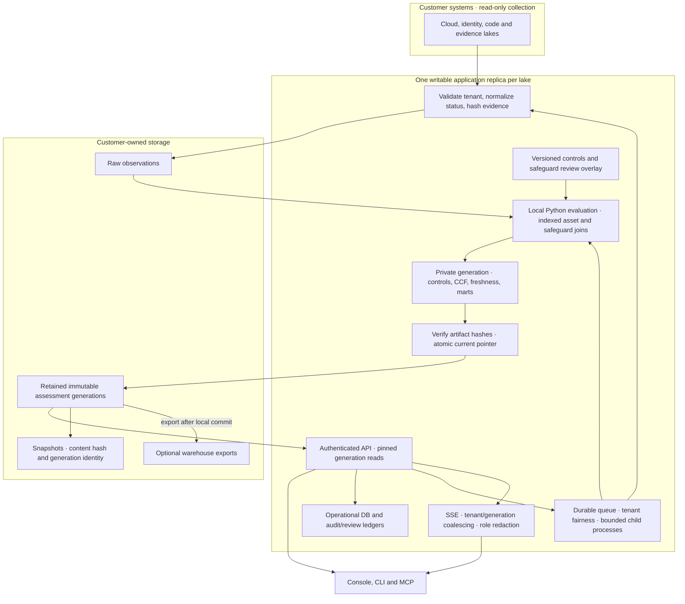

# Architecture

The system is intentionally modular. Ingestion, evidence modeling, control
evaluation, snapshots, lake adapters, API, and UI are separate capabilities with
clear contracts.

## Component Map

Collection credentials are scoped to source reads. API authentication and tenant
routing select one lake before business operations. Source `tenant_id` is
provenance and namespaces CCF asset identities; it is not an authorization claim. Agents consume the same API and can propose changes, while deterministic
rules own assessment results. Imported assertions remain assertions: a hash
establishes stored-byte integrity, not truth of the source observation.

Framework controls and CCF safeguards are separate evaluation lanes. CCF evidence
must explicitly name a safeguard, match its asset applicability, and establish an
outcome. Requirement results require all reviewed safeguard results; pending
mappings and missing evidence prevent a pass. The complete asset population is
not established by the observed-event set.

One evaluation time is shared across freshness and control-test calculations.
Incremental runs reuse normalized rows but still rebuild gold outputs when inputs,
review decisions, rules, or freshness change. Historical OSCAL exports verify the
snapshot hash and its retained generation; unavailable history fails closed.

The warehouse sink runs after local publication. API/CLI results expose local and
export outcomes independently so a sink failure does not conceal the new local
assessment. No cross-store transaction is claimed. Evaluation still holds rows in
memory; streaming source reads, indexed joins, and capped response detail do not
make one evaluation distributed. Local mode enforces one writable replica.
[Distributed mode](DISTRIBUTED.md) adds PostgreSQL-fenced publication, immutable
S3 objects, virtual tenant shards and source/date Parquet partitions; it scales
work across tenants while preserving same-tenant publication ordering.

## Module Boundaries

| Module            | Owns                                          | Does not own         |
| ----------------- | --------------------------------------------- | -------------------- |
| Connectors        | reading evidence from systems                 | control decisions    |
| Evidence model    | canonical facts, hashes, freshness            | UI state             |
| Control catalog   | framework/control metadata                    | raw event parsing    |
| Evaluation engine | pass/fail, scores, stale evidence, violations | storage-specific SQL |
| Snapshot service  | point-in-time assessment exports              | live polling         |
| Lake adapters     | Snowflake/ClickHouse/local persistence        | business rules       |
| API               | JSON contracts for humans and agents          | rendering-only state |
| UI                | interactive workflow                          | control truth        |

## Design Rules

- The evaluation engine must run without the UI.
- The UI must consume API/data contracts, not invent posture.
- Connectors may be added without changing controls.
- Controls may be added without changing connectors.
- Snowflake and ClickHouse are adapters, not hard dependencies.
- Point-in-time snapshots must be reproducible from their retained generation or embedded historical inputs.

### Assessment ownership and export boundary

Server evaluations bind the platform tenant from the authenticated request context
(or the hosted scheduler's tenant lake). A caller cannot override it with another
tenant ID. Source account IDs on normalized observations remain unchanged; they
are not the platform identity that owns the assessment. Local CLI evaluations
retain their explicit tenant ID and the default single-operator behavior.

Warehouse sinks currently use operator-owned process configuration. They are
therefore available only to local operator runs. Hosted connector materialization
and lake evaluation do not inherit those destinations or credentials. Hosted runs
at the warehouse threshold stop with the existing scale-policy error until a
tenant-scoped export destination contract is implemented. This boundary does not
qualify shared Snowflake or ClickHouse schemas for multi-tenant writes.

## Offline reports

`grc-lake dashboard --lake PATH --out REPORT.html` writes a frozen HTML report directly from the pinned lake
assessment. It renders coverage, findings, and expandable control results without
JavaScript, network access, or a console build. The embedded JSON preserves the
recorded assessment for further review; markup-like evidence is escaped without
changing its JSON values. Synthetic evidence remains labeled and sparse coverage
suppresses numeric readiness. The file presents saved results and does not refresh
freshness, authenticate evidence, or verify the ledger; use the verification tools
for those checks. The API-backed console remains available through `serve`.

## Durable operations and live reads

The API accepts bounded snapshot, evaluation, scheduler, and connector requests
into tenant-scoped durable operation rows. Acceptance supports an Idempotency-Key;
a conflicting request with the same key is rejected. Each server process runs a
bounded pool of workers (GRC_LAKE_OPERATION_WORKERS, default 2, at most 16) that
rotates claims between tenants and runs at most one job per tenant at a time, so a
long job does not block other tenants. Admission
serializes each tenant's count-and-insert and caps pending work at 100 operations.

Background execution uses a spawned process with an independent hard deadline
(default 900 seconds; GRC_LAKE_OPERATION_TIMEOUT_SECONDS must be positive and at
most 3600). The parent renews the claim and stops the child on shutdown, cancellation
or claim loss. A filesystem execution lock prevents stale-claim recovery while a
writer is still active. Interrupted work is not replayed: external or committed
side effects may already exist. Inspect domain history before submitting new work.
Queued cancellation guarantees the job was not claimed; cancellation overlapping
execution reports an interrupted outcome. Results and cancellation require the
owner or an administrator with the operation's current write scope.

SSE coalesces reads by tenant, database factory, and generation. Expensive work
holds only a per-key lock, allowing other tenants to build independently. A new
generation invalidates the key; same-generation freshness and database changes
may take up to 60 seconds to appear. The cache retains at most 32 entries, and
unused per-key locks are released. This reduces repeated computation without
claiming that a synthetic benchmark establishes production capacity.

Anonymous request audit belongs to the operator's server/security_audit directory;
authenticated records remain tenant-scoped. Recorded route templates omit path
parameters, including share tokens.

Successful JSON v1 responses declare the shared `data`, `meta`, and `errors`
envelope in OpenAPI, including endpoints that return JSONResponse directly.
Where a resource-specific model is absent, `data` remains generic: the envelope
schema is not a claim that every domain record is fully typed. Schema generation
is idempotent and preserves its input; binary and HTML routes retain their own
media types.
