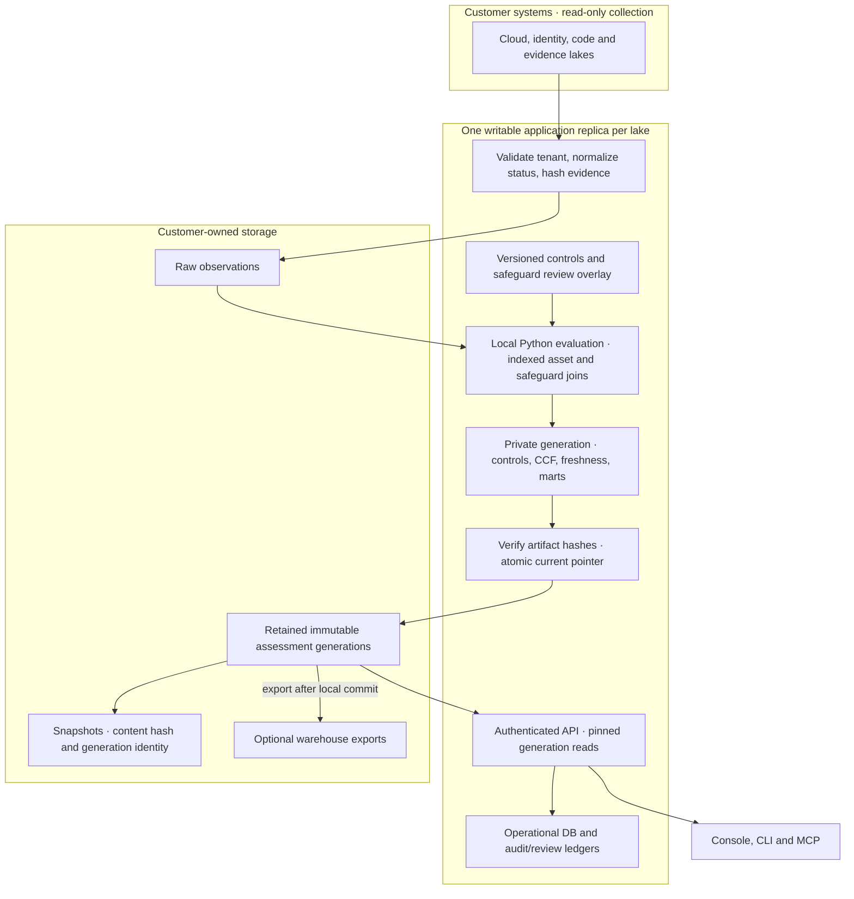

# Architecture

The system is intentionally modular. Ingestion, evidence modeling, control
evaluation, snapshots, lake adapters, API, and UI are separate capabilities with
clear contracts.

## Component Map

Collection credentials are scoped to source reads. API authentication and tenant
routing select one lake before business operations. Source `tenant_id` is
provenance and namespaces CCF asset identities; it is not an authorization claim. Agents consume the same API and can propose changes, while deterministic
rules own assessment results. Imported assertions remain assertions: a hash
establishes stored-byte integrity, not truth of the source observation.

Framework controls and CCF safeguards are separate evaluation lanes. CCF evidence
must explicitly name a safeguard, match its asset applicability, and establish an
outcome. Requirement results require all reviewed safeguard results; pending
mappings and missing evidence prevent a pass. The complete asset population is
not established by the observed-event set.

One evaluation time is shared across freshness and control-test calculations.
Incremental runs reuse normalized rows but still rebuild gold outputs when inputs,
review decisions, rules, or freshness change. Historical OSCAL exports verify the
snapshot hash and its retained generation; unavailable history fails closed.

The warehouse sink runs after local publication. API/CLI results expose local and
export outcomes independently so a sink failure does not conceal the new local
assessment. No cross-store transaction is claimed. Evaluation still holds rows in
memory; streaming source reads, indexed joins, and capped response detail do not
establish horizontal scalability. The Helm chart enforces one writable replica.

## Module Boundaries

| Module            | Owns                                          | Does not own         |
| ----------------- | --------------------------------------------- | -------------------- |
| Connectors        | reading evidence from systems                 | control decisions    |
| Evidence model    | canonical facts, hashes, freshness            | UI state             |
| Control catalog   | framework/control metadata                    | raw event parsing    |
| Evaluation engine | pass/fail, scores, stale evidence, violations | storage-specific SQL |
| Snapshot service  | point-in-time assessment exports              | live polling         |
| Lake adapters     | Snowflake/ClickHouse/local persistence        | business rules       |
| API               | JSON contracts for humans and agents          | rendering-only state |
| UI                | interactive workflow                          | control truth        |

## Design Rules

- The evaluation engine must run without the UI.
- The UI must consume API/data contracts, not invent posture.
- Connectors may be added without changing controls.
- Controls may be added without changing connectors.
- Snowflake and ClickHouse are adapters, not hard dependencies.
- Point-in-time snapshots must be reproducible from their retained generation or embedded historical inputs.
