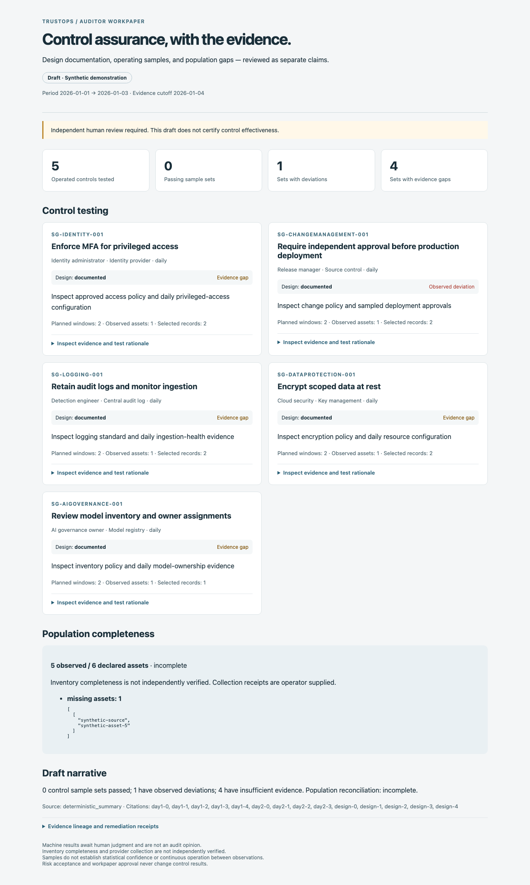

# Auditor walkthrough

This walkthrough uses synthetic records to demonstrate a reviewable control test,
including an observed failure and evidence gaps. It does not claim certification,
live-provider qualification, or effectiveness of a real organization's controls.

From a source checkout with dependencies installed:

```sh
uv run security-lakehouse pipeline run \
  --raw examples/control-assurance/events.jsonl --out build/assurance-demo
uv run security-lakehouse assessment workpaper --lake build/assurance-demo \
  --plan examples/control-assurance/plan.json \
  --baseline examples/control-assurance/baseline.json \
  --out build/auditor-workpaper
uv run security-lakehouse assessment verify-workpaper --dir build/auditor-workpaper
```

Open `build/auditor-workpaper/index.html`. The output directory must be new; use a
new name to retain earlier exports. The bundle contains JSON, portable HTML with
no external scripts or fonts, and a manifest of file hashes. A missing manifest
or mismatching file fails verification. Hash consistency detects changes relative
to the manifest; it is not an independently authenticated signature.

## What to inspect

1. **Access and encryption:** documented design and passing observations, with
   insufficient operating evidence across the declared population. Missing assets
   and compatible assets without bound samples remain gaps. Follow the recorded
   event IDs and raw hashes; these results still await review.
2. **Production changes:** a failing observation remains visible even when a
   different observation is selected for the sample.
3. **AI inventory:** the second daily window is missing. A policy document cannot
   fill that operating-evidence gap.
4. **Population:** six assets were declared, five were observed. The missing asset
   is named in both reconciliation and operating sampling gaps. Its unknown type
   cannot justify excluding it from any control. Inventory completeness remains
   independently unverified.
5. **Lineage:** each workpaper binds its plan, baseline, catalog mappings, evidence,
   and results to one verified generation. It records reviewed and proposed
   mapping states without converting proposed mappings into assurance.



## Authenticated review

Server mode adds immutable workpaper records and a separate review decision:

| Operation                                   | Authorization and contract                                                                                                                                       |
| ------------------------------------------- | ---------------------------------------------------------------------------------------------------------------------------------------------------------------- |
| `POST /api/v1/audit-workpapers`             | Control manager submits `plan` and `baseline` matching the authenticated tenant. Optional `narrative` must cite event IDs in this workpaper through `citations`. |
| `GET /api/v1/audit-workpapers`              | Tenant-scoped, paginated metadata; at most 100 records per page.                                                                                                 |
| `GET /api/v1/audit-workpapers/{id}`         | Frozen JSON content, digest, and review identity.                                                                                                                |
| `GET /api/v1/audit-workpapers/{id}/html`    | Escaped portable report, with the server review status and no-store response.                                                                                    |
| `POST /api/v1/audit-workpapers/{id}/review` | A different authenticated admin or compliance reviewer submits `decision` (`approve` or `reject`), `rationale`, and the exact `content_sha256`.                  |

A review is a one-time decision bound to the content digest. Self-review, forged
identity fields, foreign-tenant access, stale digests, and repeated decisions are
rejected. Local authentication-off mode cannot approve a workpaper. A new
assessment or corrected draft needs a new record; prior records remain unchanged.

Server-created records snapshot linked remediation tasks and their retained
verification receipts. Local CLI exports explicitly say that application-state
remediation was not included. A historical retest remains historical: workpaper
review does not rerun it or assert that a previously resolved issue remains fixed.

Optional model-generated prose is treated as an untrusted submitted draft. The
service does not invoke a model, execute instructions in its text, alter evidence,
or change machine conclusions. Missing or invented citations are rejected;
valid citations establish traceability, not the truth of the prose. The reviewer
must check every claim against the evidence. Approval acknowledges the workpaper
and its stated limitations; it does not turn a deviation or gap into a pass.

## Reproduction and limits

Plans, reports, and exports use the same evaluators as the CLI. Workpapers are
capped at 2 MiB, with at most 500 linked remediation tasks per server record; split
larger assessment scopes. Migration `0022_audit_workpapers` adds the records and
review metadata. Database access remains part of the trusted server boundary.

To regenerate the screenshot after building a fresh bundle:

```sh
node app/web/scripts/capture_workpaper.mjs build/auditor-workpaper/index.html
```

The capture script requires synthetic fixture labeling, checks desktop and mobile
overflow, and records content, HTML, and screenshot hashes. The image shows the
actual generated artifact. Existing console screenshots remain a separate product
tour. See [control test plans](CONTROL_TEST_WORKPAPERS.md),
[population reconciliation](POPULATION_RECONCILIATION.md), and
[governed remediation](GOVERNED_REMEDIATION.md) for each boundary.

## Assessment context

A control in a test plan may include `assessment_context` to record a human
assessment distinct from automated test results:

```json
{
  "state": "inherited",
  "rationale": "The provider operates this service; assess the retained responsibilities separately.",
  "evidence_event_ids": ["provider-responsibility-record"],
  "provider": "Example provider",
  "responsibilities": "Provider operates the service; customer owns access approval and review."
}
```

Supported states are `not_applicable`, `inherited`, and `compensating`. Every
state requires a rationale and 1–100 distinct evidence event IDs from the sealed
generation, explicitly bound to that safeguard and available at the assessment
cutoff. Inheritance also requires `provider` and `responsibilities`; compensation
requires `alternative_control`. Unknown fields, forged reviewers, missing or
unbound evidence, and future observations are rejected.

The API, CLI `assessment test-plan` / workpaper exports, and MCP workpaper tools
accept this optional field through the existing plan object. JSON and HTML retain
the declaration, evidence hashes, period, and generation. Existing plans remain
valid. Server workpapers start as drafts and use the existing independent human
review of the exact content digest. Local exports remain unreviewed drafts.

Approval acknowledges the declaration and its supporting evidence for that
workpaper's period and generation. It does not certify provider effectiveness,
apply to future generations, erase failures or population gaps, exclude controls
from scoring, or turn a compensating measure into an automated pass. The console
mapping-review table labels supporting and inherited relationships as context only.
