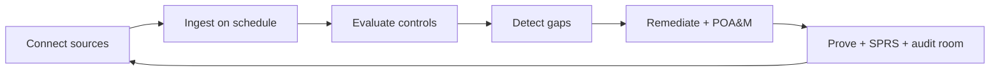

# GRC Automation

TrustOps runs the compliance loop on evidence you hold: it connects read-only
sources, evaluates controls on a schedule, opens remediation work, and freezes
proof for auditors.

## The closed loop



Every step is reachable via **API**, **MCP**, **scheduler**, and **console** — same contract,
no special surfaces.

## What ships today

| Capability                                                                              | Automation surface                                                         |
| --------------------------------------------------------------------------------------- | -------------------------------------------------------------------------- |
| Framework packs (counts in [Framework coverage](FRAMEWORK_COVERAGE.md))                 | `frameworks sync-packs`, eval engine                                       |
| **Continuous ingestion** (per-connector `sync_schedule`, lake eval every 6h by default) | Scheduler, connector runners, lake eval                                    |
| **Remediation + evidence requests**                                                     | API, UI, MCP write tools                                                   |
| **POA&M + SPRS** (CMMC / NIST 800-171)                                                  | `GET /api/v1/gov-compliance/sprs`, `POST /api/v1/gov-compliance/poam/sync` |
| **Audit readiness score**                                                               | Platform API + audit room                                                  |
| **Agent harness**                                                                       | MCP tools with approval gates                                              |
| **Executive PDF**                                                                       | Snapshot export                                                            |

## Headless agent verbs

Agents with `TRUSTOPS_API_URL` + `TRUSTOPS_API_KEY` can:

1. `get_sprs_score` — CMMC Level 2 SPRS from live control tests
2. `sync_poam_from_posture` — auto-create POA&M rows from failing practices
3. `list_poam_items` — milestone-tracked gov gaps
4. `create_remediation_task` / `create_evidence_request` — close the loop without console
5. `escalate_stale_evidence` — freshness → tasks (existing)

Example flow:

```text
escalate_stale_evidence → sync_poam_from_posture → create_remediation_task → create_evidence_request
```

## Known gaps

| Gap                                    | Status                                                                                       |
| -------------------------------------- | -------------------------------------------------------------------------------------------- |
| HRIS / MDM personnel connectors        | MDM: `intune-devices`. HRIS: `bamboohr-personnel`, `rippling-personnel`, `workday-personnel` |
| Pack-specific connector evidence hints | **Shipped** — framework drill-down shows recommended connectors per control                  |
| FedRAMP 323-selected overlay           | After Moderate baseline pack                                                                 |
| Scheduled executive narrative packs    | Snapshot PDF today                                                                           |
| Billing / SCIM self-serve              | Gated commercial features; see [Commercial hosted](COMMERCIAL_HOSTED.md)                     |

See [HEADLESS_GRC.md](HEADLESS_GRC.md), [FRAMEWORK_PACKS.md](FRAMEWORK_PACKS.md), and [ROADMAP.md](../ROADMAP.md).
