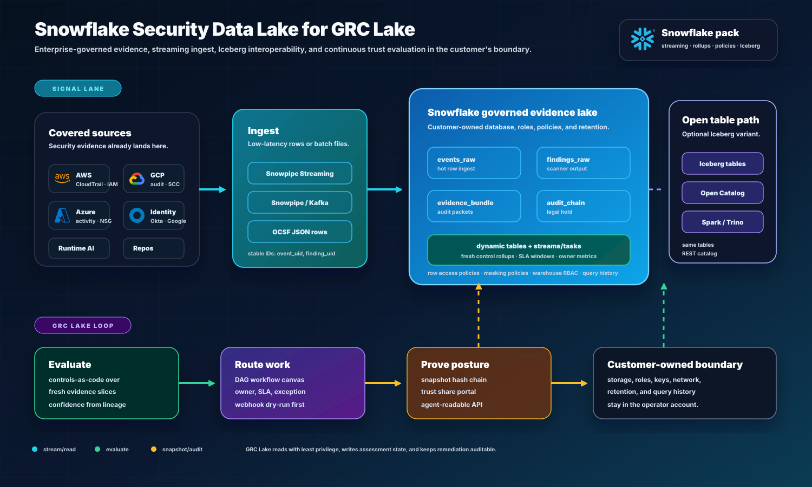
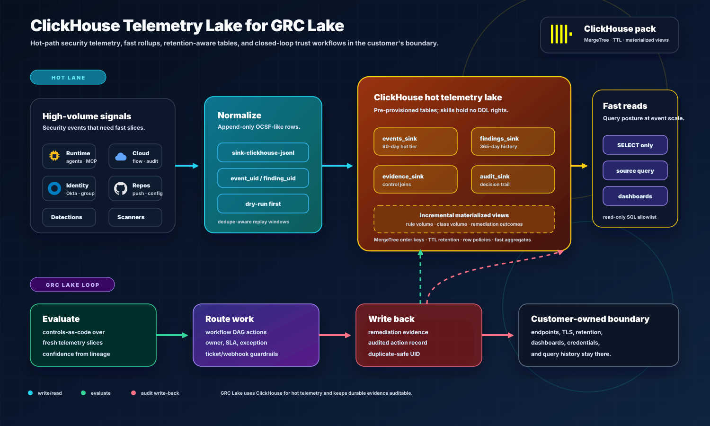

# Hero security data lakes

This project tells a customer-owned security data lake story:

| Backend           | Best fit                               | Security value                                                             | Status                                                                  |
| ----------------- | -------------------------------------- | -------------------------------------------------------------------------- | ----------------------------------------------------------------------- |
| Snowflake         | governed enterprise evidence lake      | audit shares, retention, RBAC, rollups, query history, Iceberg option      | executable read-only runner; mapped tables experimental                 |
| ClickHouse        | high-volume telemetry analytics lake   | runtime event windows, fast detection analytics, TTL, materialized rollups | read-only runner over `normalized_events`; mapped tables experimental   |
| Databricks        | governed lakehouse / AI estates        | Unity Catalog evidence views, workspace audit log, service-principal reads | read-only runner, live verification pending; mapped tables experimental |
| Iceberg / Parquet | open-table lakes, Amazon Security Lake | OCSF tables in place, Glue or REST catalogs, partition-pruned scans        | preview reader, live verification pending                               |
| BigQuery          | Google Cloud security warehouse        | parameterized reads, workload identity, bytes-billed cap                   | preview reader, live verification pending                               |

The Snowflake, Databricks, and ClickHouse readers still read GRC Lake-shaped
views or tables by default. To read tables you already have, such as OCSF tables
from Amazon Security Lake, configure a lake mapping instead; see
[BRING_YOUR_OWN_LAKE.md](BRING_YOUR_OWN_LAKE.md).

The local pipeline remains the source of truth for the demo. It writes replayable
bronze/silver/gold artifacts and a SQLite mart so the project can run anywhere.
Snowflake and ClickHouse artifacts show how the same normalized model maps to
production-grade backends without moving customer evidence into a vendor silo.

## Snowflake Story

Snowflake is the governed enterprise evidence lake:

- lands low-latency evidence through row streaming or staged files
- supports governed read roles, row policies, masking policies, and query history
- reads configured evidence views for local deterministic evaluation; it may pull every selected record
  into the app
- can expose the same tables through an Iceberg/Open Catalog path when the
  customer wants open-format interoperability
- keeps evidence, retention, audit history, and role boundaries in the operator
  account

Use Snowflake when the question is:

- "Can audit and GRC trust this evidence?"
- "Can business leaders slice risk by owner, product, and environment?"
- "Can we share controlled evidence with internal stakeholders?"
- "Can the trust tool evaluate posture where our lake already lives?"



### Which Snowflake Ingestion Lane To Use

| Lane                 | Best fit                                                               | GRC Lake behavior                                                     |
| -------------------- | ---------------------------------------------------------------------- | --------------------------------------------------------------------- |
| Row streaming        | runtime AI events, identity changes, detections, policy events         | append rows into evidence/event tables with stable IDs                |
| Staged files         | scanner exports, access review bundles, SARIF, vendor evidence packets | load batch files, preserve raw hash, then normalize                   |
| Read-only views      | customer already has a governed Snowflake security lake                | query least-privilege views and rebuild current posture               |
| Iceberg/Open Catalog | customer wants open table access across engines                        | keep tables interoperable for Spark, Trino, DuckDB, and other readers |

The live Snowflake runner is intentionally read-only by default. It expects
GRC Lake-shaped evidence views, or mapped existing tables
([BRING_YOUR_OWN_LAKE.md](BRING_YOUR_OWN_LAKE.md)), with a least-privilege role, writes collected rows
into managed raw connector evidence, and lets the same pipeline rebuild bronze,
silver, gold, snapshots, and current posture. The runner does not create
Snowflake objects, mutate warehouse state, or require DDL privileges.

Official Snowflake references:

- [Snowpipe Streaming](https://docs.snowflake.com/en/user-guide/snowpipe-streaming/data-load-snowpipe-streaming-overview)
  for low-latency row ingestion and Kafka/application event streams.
- [Dynamic tables](https://docs.snowflake.com/en/user-guide/dynamic-tables/overview)
  for declarative rollups from fresh evidence into posture-ready views.
- [Streams](https://docs.snowflake.com/en/user-guide/streams-intro) and tasks
  for change tracking and scheduled SQL-native workflows.
- [Row access policies](https://docs.snowflake.com/en/user-guide/security-row-intro)
  and masking policies for tenant, role, and sensitive-field controls.
- [Snowflake Open Catalog with Apache Iceberg](https://docs.snowflake.com/en/user-guide/tables-iceberg-open-catalog)
  for open-table interoperability where the operator wants external engines to
  read the same governed table path.

Primary artifacts:

- [Snowflake schema](../deploy/snowflake/schema.sql)
- [Snowflake connector model](CONNECTORS.md#connector-runner)
- [Dual-lakehouse diagram](diagrams/dual-lakehouse.md)

## ClickHouse Story

ClickHouse is the high-throughput security telemetry lake:

- stores normalized events and runtime security telemetry
- optimizes time-window, severity, source, and asset aggregations with hot
  columnar tables
- powers low-latency dashboards, detection replay, and investigation queries
- uses materialized views for fresh rollups instead of recomputing every query
- keeps high-cardinality runtime/event data cost-controlled with retention and
  TTL policy
- supports read-only SQL replay paths for agents and analysts

Use ClickHouse when the question is:

- "What happened in the last 15 minutes?"
- "Which runtime policies are blocking risky agent behavior?"
- "Which assets and controls are trending worse at event scale?"
- "Which owners, controls, and environments are producing the most event-driven
  remediation work?"



### Which ClickHouse Lane To Use

| Lane                 | Best fit                                                 | GRC Lake behavior                                               |
| -------------------- | -------------------------------------------------------- | --------------------------------------------------------------- |
| Hot event write      | runtime AI, detections, cloud activity, identity changes | append rows through stable IDs into pre-provisioned sink tables |
| Materialized rollups | posture widgets, severity windows, owner workload        | refresh incremental aggregates for dashboards and alerts        |
| Read-only replay     | analysts and agents asking historical control questions  | run allowlisted `SELECT` queries over event/evidence slices     |
| Audit write-back     | workflow decisions, owner actions, remediation artifacts | append action records with stable IDs for duplicate-safe replay |

Official ClickHouse references:

- [MergeTree](https://clickhouse.com/docs/engines/table-engines/mergetree-family/mergetree)
  for ordered, high-volume event tables.
- [Incremental materialized views](https://clickhouse.com/docs/materialized-view/incremental-materialized-view)
  for query-speeding rollups.
- [TTL](https://clickhouse.com/docs/guides/developer/ttl) for retention and
  lifecycle control.
- [Iceberg table engine](https://clickhouse.com/docs/engines/table-engines/integrations/iceberg)
  for open-table interoperability where customers use Iceberg-backed storage.

Primary artifacts:

- [ClickHouse schema](../deploy/clickhouse/schema.sql)
- [Local ClickHouse compose file](../deploy/clickhouse/docker-compose.yml)
- [Dual-lakehouse diagram](diagrams/dual-lakehouse.md)

## Databricks Story (Preview)

`databricks-evidence-lake` reads the same four GRC Lake evidence views as
Snowflake (`GRC_LAKE_AUDIT_EVENTS`, `GRC_LAKE_CONTROL_POSTURE`,
`GRC_LAKE_ASSET_RISK`, `GRC_LAKE_EVIDENCE_BUNDLES`) from a Unity Catalog schema,
through a SQL warehouse, without copying evidence out of the workspace.

| Bar                | Status                                                                                        |
| ------------------ | --------------------------------------------------------------------------------------------- |
| Connector contract | Done: `connectors/catalog.json` row, OAuth M2M service principal, enablement validation       |
| Schema artifact    | Done: [`deploy/databricks/bootstrap_poc.sql`](../deploy/databricks/bootstrap_poc.sql)         |
| Tests              | Done: fixtures plus a fake Statement Execution API (token, polling, chunks, host pinning)     |
| Verified demo path | **Pending**: not yet run against a live workspace; treat the connector as preview until it is |
| Mapped tables      | Experimental: read existing Unity Catalog tables through a lake mapping instead of the views  |

Least privilege is `CAN USE` on one SQL warehouse plus `USE CATALOG`,
`USE SCHEMA`, and `SELECT` on the evidence views. On SQL warehouses, Unity
Catalog checks the view owner's permissions on `system.access.audit`, so the
service principal never needs access to system tables. Setup steps are in
[CONNECTORS.md](CONNECTORS.md#databricks-evidence-lake-preview).

Official Databricks references:

- [Delta Lake](https://docs.databricks.com/aws/en/delta/) for lakehouse table
  storage.
- [Unity Catalog](https://docs.databricks.com/aws/en/data-governance/unity-catalog/)
  for governance, lineage, permissions, and audit-oriented controls.

## Portfolio Positioning

This is not just a dashboard. It demonstrates:

- security event modeling
- control mapping
- evidence lineage
- warehouse/lakehouse schema design
- operational analytics
- auditor-facing reporting
- agent-assisted investigation

The same event model can land in both warehouses:

```text
raw JSONL evidence
  -> bronze replay records
  -> silver normalized_events
  -> gold control_posture + asset_risk + metrics
  -> Snowflake governed evidence lake
  -> ClickHouse high-volume telemetry lake
  -> Databricks governed lakehouse (preview, Unity Catalog views)

existing customer tables (OCSF / Security Lake, Iceberg, Parquet, BigQuery, warehouse tables)
  -> lake mapping (read-only, parameterized)
  -> raw evidence -> the same bronze/silver/gold pipeline
```
