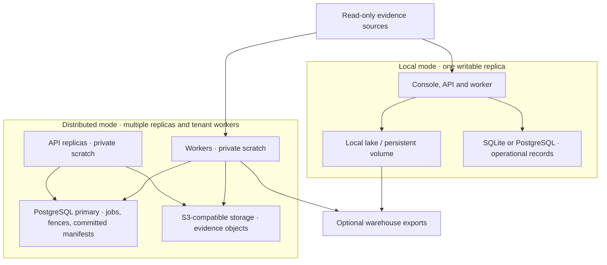

# Deployment models

GRC Lake is self-hosted software. Local and distributed modes use the same
assessment engine; operators own credentials, storage, backups, and availability.

The loopback demo uses synthetic fixtures and disables authentication. Production
installations require authentication and explicit tenant routing. Distributed
mode must be configured explicitly; adding replicas to a local deployment does
not make its publication safe. One tenant evaluation runs on one worker.

PostgreSQL failover and object-store replication belong to the operator's
infrastructure. Synthetic CI qualification does not establish production
capacity or provider availability.

See [deployment](../DEPLOYMENT.md), [distributed mode](../DISTRIBUTED.md), and
[architecture](../ARCHITECTURE.md).
